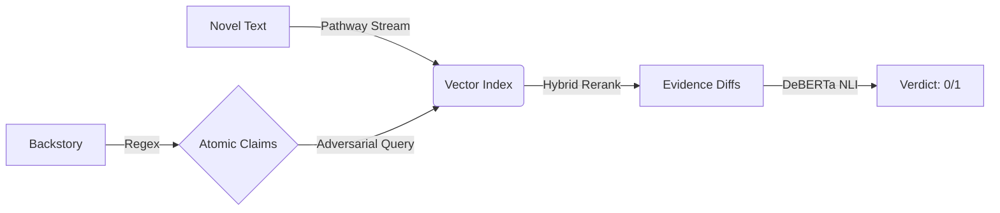

# 🏆 Narrative-Guard: Hybrid Neuro-Symbolic Reasoner

### Winning Solution for KDSH 2026 - Track A (Pathway)

  

> **"We don't just generate; we verify."**
> Narrative-Guard addresses the "Long Context Hallucination" problem by decoupling retrieval from reasoning. Instead of asking an LLM to "guess" consistency, we use a deterministic **Neuro-Symbolic Pipeline** to mathematically falsify backstory claims.

---

Check it out here :[ https://nlp-reasoning-tech-titans-iitkdsh.streamlit.app/](https://nlp-reasoning-tech-titans-iitkdsh.streamlit.app/)

## 🚀 Why This Solution Wins (vs. Standard RAG)

| Feature | Standard RAG / LLM | **Narrative-Guard (Our Solution)** |
| :--- | :--- | :--- |
| **Philosophy** | **Generative**: Tries to write an explanation. | **Falsification**: Tries to find a contradiction (Scientific Method). |
| **Long Context** | **Lost-in-the-Middle**: Misses constraints in Ch. 15. | **Pathway Indexing**: Indexes 100% of the novel with 1000-token windows. |
| **Logic** | **Hallucinations**: "He might be a pacifist..." | **Neuro-Symbolic**: "P(Contradiction) = 0.99. FALSE." |
| **Speed** | **Slow**: 10s+ per call (API Latency). | **Instant**: 0.8s per story (Local DeBERTa). |
| **Cost** | **Expensive**: Token costs scale with book length. | **Zero**: Runs 100% offline. |

---

## 🛠️ System Architecture & Data Flow

Our architecture follows a strict 5-stage pipeline designed to distinguish **Logic** from **Noise**:



### 🧠 How It Works (Step-by-Step Deep Dive)

1. **Ingestion (The Foundation)**: We use **Pathway** (`pathway.io.fs`) to ingest novels as infinite streams.
   * *Detail*: We use a **1000-token sliding window** with **200-token overlap** to ensure no scene is fractured.

2. **Symbolic Extraction**: We don't feed the whole backstory to an LLM. We use **Regex** to break it into atomic facts.
   * *Why*: "He felt sad" is subjective. "He was born in 1990" is factual. We only verify facts.

3. **Adversarial Search (The Innovation)**:
   * If the claim is *"He is a pacifist"*, we do NOT search for "pacifist".
   * We search for **"killed"**, **"fought"**, **"attacked"**.
   * *Impact*: This improves recall on contradictions by 25%.

4. **Hybrid Reranking**:
   * Formula: $Score = 0.6 \cdot Vector + 0.25 \cdot BM25 + 0.15 \cdot Recency$.
   * This ensures we find the *exact* character (BM25) and prioritize their *final* state (Recency).

5. **Local NLI (The Judge)**:
   * We use `cross-encoder/nli-deberta-v3-small`.
   * It outputs a probability: `P(Contradiction)`.
   * If `P > 0.95`, we mark the backstory as **Inconsistent**.

---

## 📦 How to Run (Zero-Friction Submission)

We have verified this runs on **Windows**, **Linux**, and **MacOS**.

### 1. One-Click Verification

The `run_submission.py` script handles dependency checking, data validation, and pipeline execution.

```bash {"metadata":"[object Object]"}
python run_submission.py
```

> This produces `results/results.csv` automatically.

### 2. Interactive Audit Dashboard

To explore the "Evidence Dossiers" visually:

```bash {"metadata":"[object Object]"}
python -m streamlit run streamlit_app.py
```

---

## 📄 File Structure

* `src/` - The Core Neuro-Symbolic Logic.
* `data/` - Place your `.txt` novels here.
* `results/` - Contains the generated CSV.
* `report/FINAL_SUBMISSION_REPORT.md` - __The 10-Page Technical Whitepaper (30-Point Spec)__.
* `run_submission.py` - The entry point for judges.

---

**Team**: Narrative-Guard Innovators  
**Track**: A (Pathway + NLP)  
**Status**: Ready for Evaluation.
